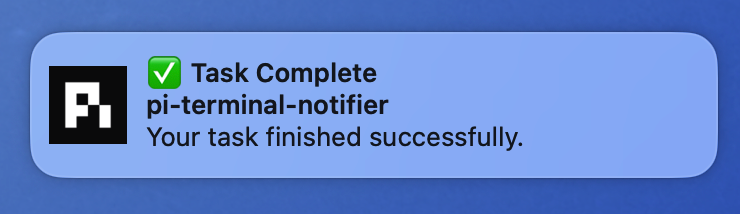

# pi-terminal-notifier

**macOS native notifications for pi — focus-aware, click-to-activate, with a namespaced event bus.**

[](https://www.gnu.org/licenses/gpl-3.0)

## Why

When pi finishes a long turn or needs input, you are often in another app. pi-terminal-notifier posts a native macOS banner with a short sound, skips noise while you are already looking at the terminal, and brings you back on click.



## Install

```bash
pi install git:github.com/ouzhenkun/pi-terminal-notifier
```

Then run `/reload` or restart pi.

For local development:

```bash
pi install /absolute/path/to/pi-terminal-notifier
```

## How it works

| Source | Behavior |
|--------|----------|
| **agent_end** | ✅ Task Complete / ❌ Task Failed from the last assistant text; suppressed when the pi terminal is frontmost |
| **Event bus** | Other extensions emit `pi-terminal-notifier:notify` for approvals, plan ready, etc. |

Foreground suppression is skipped when `force: true` (use when the user must act).

**Click-to-activate** focuses Ghostty, VS Code, Terminal, or iTerm2. Inside tmux, it also selects the originating window and pane.

## Events

```ts
pi.events.emit("pi-terminal-notifier:notify", {
  title: "Approval Needed",
  body: "Allow bash?",
  sound: "question", // see Sounds
  force: true,       // skip foreground suppression
  // subtitle?, group?
});
```

| Field | Description |
|-------|-------------|
| `title` | Notification title |
| `body` | Message body |
| `subtitle` | Optional; defaults to the current directory basename |
| `sound` | Sound key (filename without extension) |
| `force` | Skip frontmost-terminal suppression |
| `group` | terminal-notifier group id (replace previous in same group) |

## Sounds

| Key | File |
|-----|------|
| `task-complete` | `sounds/task-complete.aiff` |
| `review-complete` | `sounds/review-complete.aiff` |
| `question` | `sounds/question.aiff` |
| `plan-ready` | `sounds/plan-ready.aiff` |
| `error` | `sounds/error.aiff` |

Played via `afplay`. Source MP3s and full attribution: [NOTICE](NOTICE).

## Compatibility

| Environment | Notifications | Foreground suppression | Click to activate |
|-------------|---------------|------------------------|-------------------|
| Ghostty | Supported | Supported | Supported |
| VS Code terminal | Supported | Workspace-aware | Supported |
| Apple Terminal | Supported | Supported | Supported |
| iTerm2 | Supported | Supported | Supported |
| tmux | Supported | Active pane/window-aware | Returns to the originating pane |
| Other terminals | Supported | Not detected | Not available |

VS Code foreground detection checks the front window's workspace against the current working directory. In tmux, suppression checks whether the originating pane and window are active; clicking a notification selects that window and pane before focusing the terminal.

### Tested

- Apple Silicon, macOS 15
- Ghostty running tmux
- Native notification delivery and sound playback

Ghostty + tmux is the environment tested by the author. VS Code, Apple Terminal, and iTerm2 integrations are implemented from their process and bundle identifiers but have not yet been independently verified.

## Requirements / Notes

- **macOS only**
- Bundled notifier is **Apple Silicon (arm64) only**, ad-hoc signed, not notarized
- First use may need Notification permission (and Automation for VS Code window-title checks)
- Browser/GitHub downloads may be Gatekeeper-quarantined; a local clone usually works as-is
- Child processes (`pi -p`, `--no-session`) and subagent sessions do not register user-facing notifications

## License

**GPL-3.0-or-later** — see [LICENSE](LICENSE).

Third-party components, including the notifier binary and sound assets, are documented in [NOTICE](NOTICE).
